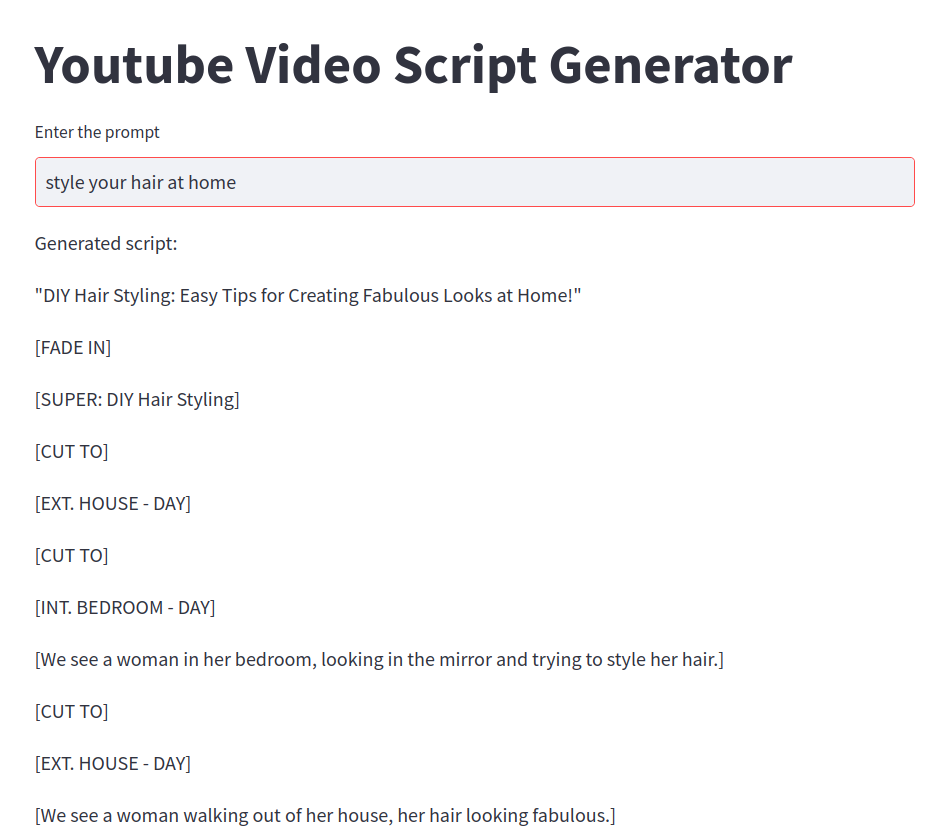

## Goal- Demo LLM workflow with Langchain -

1. How  prompt templates can be used effectively to save users the hassle to write elaborate prompts.

2. How to do simple chaining operation with [LangChain](https://python.langchain.com/en/latest/index.html) where output from LLM can be used as input to query other service such as wikipedia

 
For demo, let us create a simple streamlit app where a user can enter the topic that interests them as a prompt. The app will use langchain and LLMs (depending on configuration) to generate title and script for the topic, and present to user. 

The prompt may look like -

```
Write me a youtube video tile about ------------
```

LangChain prompt templates help to automate the prompt structuring behind the scene so that the user can simply enter only the topic in place of  -------------
This feature of LangChain is quite useful to improve prompting, as the user need not know how to efficiently structure the prompt.


## Installation of requisites

```
git clone https://github.com/suvarnak/ChainingLLms.git
conda create -n "llm_env" python=3.8
conda activate llm_env
pip install streamlit langchain openai==0.27.0 tiktoken wikipedia chroma python-dotenv
```
Create a `.env` file and paste your API key in it.

## To run the app
```
streamlit run llm_chain.py

```

## Demo output 


